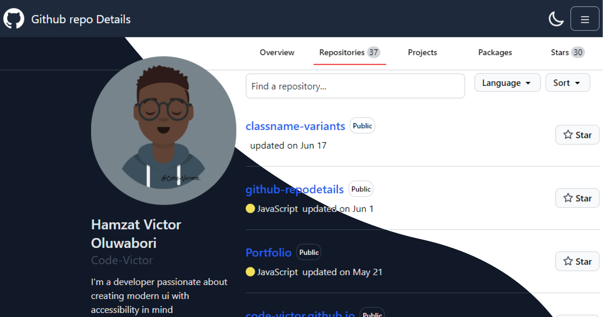

<!-- Please update value in the {}  -->

<h1 align="center">Github Repo Details</h1>

View Github Repository stats at a glance

  <h3>
    <a href="https://code-victor.github.io/interior-consultant-landing-page/">
      Demo
    </a>
     | 
    <a href="https://github.com/Code-Victor/interior-consultant-landing-page">
      Code
    </a>
  </h3>

<!-- TABLE OF CONTENTS -->

## Table of Contents

- [Overview](#overview)
  - [Built With](#built-with)
- [Features](#features)
- [Contact](#contact)
- [Acknowledgements](#acknowledgements)

<!-- OVERVIEW -->

## Overview

inspired by the <a href="http://devchallenges.io" target="_blank">Github</a> home sreen,I built this app that allows you to log into your github account and get your repository details at a glance. It also supports complex search and theming(dark and light) 

My Big Takeways
- Authentication with Firebase
- Data fetching with Redux

### Built With

<!-- This section should list any major frameworks that you built your project using. Here are a few examples.-->

- [React](https://reactjs.org/)
- [Redux Toolkit](https://redux-toolkit.js.org/)
- [Firebase](https://firebase.google.com/)
- [Tailwind CSS](https://tailwindcss.com/)

## Features
- Beautiful User Inteface
- Fully responsive
- Dark and Light mode(synced with localStorage)
- Authentication with Firebase
<!-- List the features of your application or follow the template. Don't share the figma file here :) -->

## Acknowledgements

<!-- This section should list any articles or add-ons/plugins that helps you to complete the project. This is optional but it will help you in the future. For exmpale -->

- [Tailwind CSS docs( I had to check up on many of the class names😂)](https://tailwindcss.com/)
- [Setting Redux toolkit query](https://redux-toolkit.js.org/rtk-query/overview)
- [Detecting if a React component is in viewport ](https://www.npmjs.com/package/react-in-viewport)

## Contact

- Website [code-victor.github.io](https://https://code-victor.github.io/)
- GitHub [Code-Vcitor](https://github.com/Code-Victor)
- Twitter [@TheFireAndCode](https://twitter.com/TheFireAndCode)
